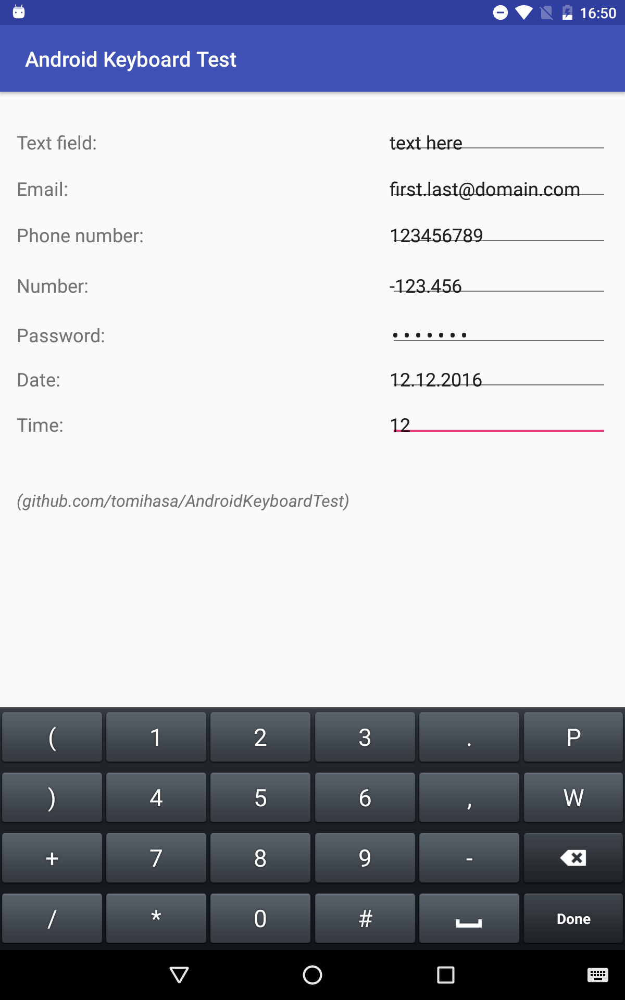

# Android Keyboard Test

**Test a virtual keyboard with this application.**

### Description
This application has no *real functionalities*, it is only for testing the different keyboard modes using your virtual keyboard. The keyboard mode depends on the input type (`android:inputType`), which can be for example text, email address, phone number, integer, decimal, or a password.

### Tested with
Android Studio 2.

[Github URL](https://github.com/tomihasa/androidkeyboardtest)
